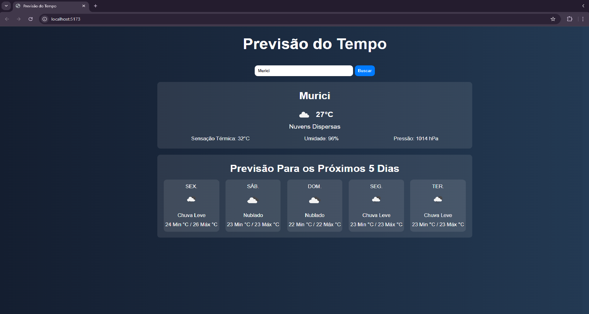

# 🌤️ Projeto Previsão do Tempo

Este projeto foi desenvolvido com foco educacional, como parte dos meus primeiros estudos em React.

A ideia principal foi aprender na prática como funciona a construção de interfaces com componentes, manipulação de estados e consumo de APIs externas, utilizando um projeto real para reforçar os conceitos iniciais da biblioteca.

## 📸 Preview do Projeto

## 📚 Sobre o aprendizado

Durante o desenvolvimento deste projeto, pratiquei conceitos importantes para quem está iniciando em React, como:

- Criação de componentes
- JSX
- Props
- useState
- Eventos (onClick / onChange)
- Renderização condicional
- Consumo de API
- Organização de arquivos
- Estilização com CSS

## 🚀 Tecnologias utilizadas

- React
- JavaScript
- HTML5
- CSS3
- Axios
- API OpenWeather

## 🌎 Funcionalidades do projeto

- Buscar cidade pelo nome
- Exibir temperatura atual
- Sensação térmica
- Umidade do ar
- Condição climática
- Ícone do tempo
- Previsão do tempo para os próximos 5 dias

## 🎯 Objetivo

Mais do que criar uma aplicação, este projeto teve como objetivo fortalecer minha base em React através da prática, entendendo melhor como a biblioteca funciona.

## 👨‍💻 Desenvolvido por

Leonardo Silva